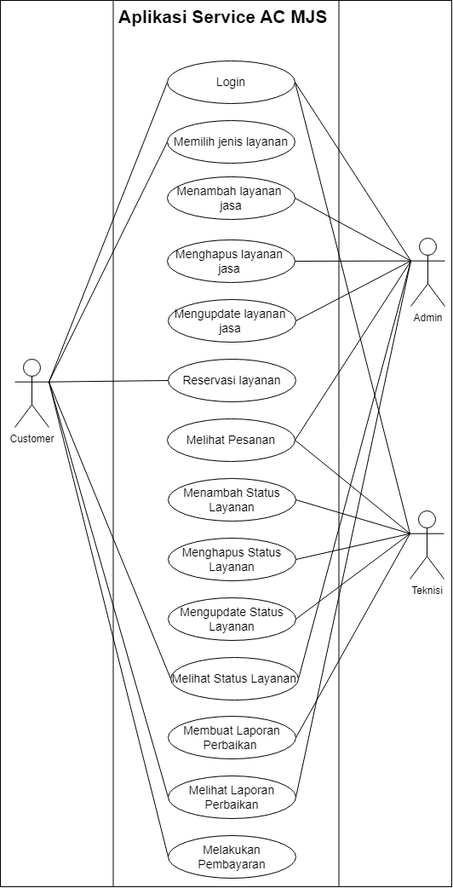
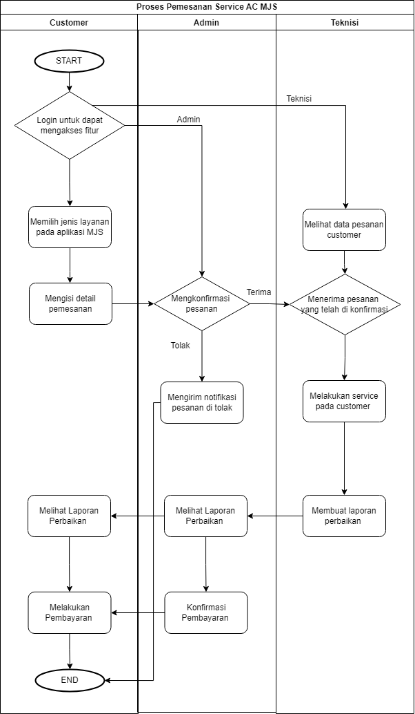
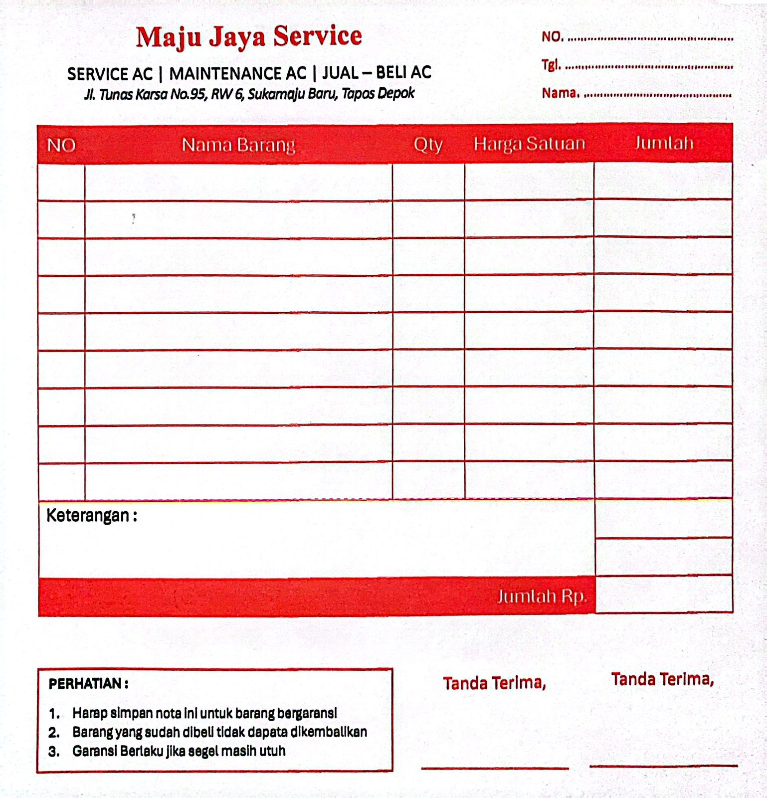

# MAJU JAYA SERVICE 
---

## Nama Anggota Kelompok 
- Ramadhani Prasetyo - 4522210009
- Daffa Abraar Sajuti - 4522210040
- Farah Tri Mahardini - 4522210042
- Salwa Khairu Mista - 4522210066
- Nadia Ayu Rahmawati - 4522210077
  
---
### Latar Belakang
Maju Jaya Service (MJS) adalah perusahaan layanan AC dan kulkas yang menyediakan berbagai layanan, termasuk perawatan rutin, penjualan, pemasangan, perbaikan, dan pemindahan. Mereka memiliki jadwal rutin untuk layanan harian dan melayani baik di Depok maupun di luar kota dalam skala kecil. Semua harga layanan dijelaskan secara rinci untuk transparansi konsumen, dan perusahaan memiliki logo yang dikenal oleh pelanggan. Meskipun mereka menyesuaikan pembayaran dengan keadaan, layanan kredit tidak tersedia saat ini. Tim yang terlatih siap untuk menangani pengerjaan, tetapi keberadaan tim kurang efektif jika pengerjaan dilakukan secara pribadi.Dengan masalah yang ada untuk memberikan kemudahan kepada konsumen dalam memperoleh informasi tentang layanan yang ditawarkan, termasuk jadwal rutin, harga-harga terkait, dan prosedur pemesanan. Upaya akan dilakukan untuk meningkatkan fitur dan keterjangkauan penggunaan bagi segmen tersebut. Melalui website, juga diharapkan dapat memfasilitasi pembayaran yang sesuai dengan kebutuhan pelanggan, termasuk kemungkinan pembayaran setelah pengerjaan untuk barang kecil dan penyesuaian pembayaran dari pihak ketiga. Dengan demikian, pembuatan website ini akan menjadi sarana penting dalam memperluas jangkauan dan meningkatkan efektivitas layanan MJS Maju Jaya Service.

---
### Kendala Maju Jaya Service 
1. Pemilik layanan sulit untuk memberikan informasi yang cukup kepada pelanggan secara efektif.
2. Skala layanan di luar kota yang sangat kecil, menjadi hambatan dalam pengembangan bisnis karena potensi pasar di luar kota kurang maksimal.
3. Kebanyakan pengguna pribadi pada website terdahulu
4. Jadwal layanan dan pemesanan yang bentrok membuat pemilik menjadi kurang efisien dalam manajemen jadwal.
5. Industri layanan sangat kompetitif, dengan banyak penyedia layanan yang bersaing untuk mendapatkan perhatian pelanggan.
6. Kurangnya perkembangan fitur website terdahulu

---
### Requirement
**1. Fitur Customer**	
- login ke akun customer
- Reservasi Layanan
- Melihat Status Layanan
- Membuat Pesanan
- Melihat Laporan Perbaikan
  
**2. Fitur Admin**
- login ke akun Admin
- Menambah Layanan Jasa
- Menghapus Layanan Jasa
- Mengupdate Layanan Jasa
- Melihat Status Layanan
- Melihat Laporan perbaikan
  
**3.Fitur Teknisi**
- Login ke akun Teknisi
- Melihat Pesanan
- Menambah status Layanan
- Menghapus status Layanan
- Mengupdate status Layanan
- Melihat Status Layanan
- Membuat Laporan Perbaikan

---
### Actor
**Actor yang menggunakan**
Aktor
- Customer: Pelanggan yang menggunakan aplikasi untuk memesan layanan perbaikan.
- Teknisi: Teknisi yang melakukan perbaikan.
- Admin: Administrator yang mengelola aplikasi dan sistem.

---
### Use Case

Pada use case beberapa fungsi yang bisa digunakan tiap actor

1. Customer
- Customer dapat login ke akun customer 
- Customer dapat memilih jasa layanan 
- Customer dapat reservasi layanan
- Customer dapat melihat status layanan 
- Customer dapat melihat laporan perbaikan
- Lalu customer akan melakukan pembayaran
2. Admin 
- Admin dapat login ke akun admin 
- Admin dapat menambah layanan jasa  
- Admin dapat menghapus layanan jasa 
- Admin dapat mengupdate layanan jasa 
- Admin dapat melihat pesanan 
- Admin juga dapat melihat laporan perbaikan 
3. Teknisi 
- Teknisi dapat login ke akun teknisi 
- Teknisi juga dapat melihat pesanan 
- Teknisi dapat menambah status layanan
- Teknisi dapat menghapus status layanan
- Teknisi dapat mengupdate status layanan
- Teknisi akan membuat laporan perbaikan

---
### ERD (Entity Relationship Diagram)

Terdapat 6 entitas pada ERD Jasa Service MJS seperti:
- Customer
- Admin
- Teknisi
- Order
- Service
- StatusService

Tiap entitas memiliki atribut
- Customer --> (IDcustomer, Nmcustomer, NoTelp, Alamat, Password)
- Admin --> (IDadmin, Nmadmin, NoTelp_admin, Password, IDcustomer)
- Teknisis --> (IDteknisi, Nmteknisi, NoTelpteknisi, Password, IDcustomer)
- Order --> (IDorder, Tglorder, IDcustomer, IDstatus, IDteknisi, IDservice)
- Service --> (IDservice, Nmservice, Harga)
- StatusService --> (IDstatus, keterangan)

Adapun relationship antar entitas seperti:
1. dilayani --> pada entitas customer dan admin
2. ditangani --> pada entitas customer dan teknisi
3. Memesan --> pada entitas customer dan order
4. Mencakup --> pada entitas order dan Admin
5. Mencakup --> pada entitas order dan teknisi
6. Mencakup --> pada entitas order dan service
7. Berstatus --> pada entitas order dan StatusService

Terdapat kardinalitas juga seperti many to one

---
### Class Diagram

Hampir sama seperti ERD, yang membedakan adalah adanya classpada class diagram serta tidak terdapat relationship, kardinalitas.

Contoh class dalam entitas Customer
-Login()
-VerifikasiLogin()
-BuatPesanan()
-RsrvsiSrvice()
-LihatStatusSrvice()
-LihatLprnPrbaikan()

Contoh class dalam entitas Admin
-Login()
-VerifikasiLogin()
-TmbhLynanSrvice()
-HpsLynanSrvice()
-UpdateLynanSrvice()
-LihatStatusSrvice()
-LihatLprnPrbaikan()

Contoh class dalam entitas Teknisi
-Login()
-VerifikasiLogin()
-LihatPesanan()
-TmbhStatusSrvice()
-UpdateStatusSrvice()
-HpsStatusSrvice()
-BuatLprnPrbaikan()

---
### Flowchart

Flowchart dimulai dengan customer melakukan login untuk masuk kedalam aplikasi begitu juga dengan admin dan teknisi.Selanjutnya customers memilih jenis layanan yang ada pada web MJS lalu customers mengisi detail pemesanan.Lalu admin yang sudah melakukan login ke aplikasi bisa langsung mengkonfirmasi pesanan, jika di tolak maka selesai.Jika diterima, maka teknisi yang sudah melakukan login ke aplikasi dapat menerima pesanan yang telah di konfirmasi admin, dan teknisi melakukan service pada rumah customer. Setelah teknisi melakukan service pada rumah customer, customers dapat melakukan pembayaran dan proses selesai. 

---
### DataMentah

---

---

### Sequence Diagram

1. Sequence Diagram Customer

3. Sequence Diagram Admin
   

5. Sequence Diagram Teknisi

--- 

### Activity Diagram

Alur Aktivitas:
- Customer Login: Customer melakukan login ke aplikasi MJS.
- Memilih Jenis Layanan: Customer memilih jenis layanan servis AC.
- Mengisi Detail Pemesanan: Customer mengisi detail pemesanan, seperti nama, alamat, dan deskripsi masalah AC.
- Konfirmasi Pesanan: Customer mengkonfirmasi pesanan.
- Admin Menerima Pesanan: Admin menerima pesanan dari Customer.
- Admin Meneruskan Ke Teknisi: Admin menunjuk Teknisi yang sesuai untuk menangani servis AC di lokasi Customer.
- Teknisi Menerima Pesanan: Teknisi menerima notifikasi tentang pesanan yang ditugaskan kepadanya.
- Teknisi Berangkat ke Lokasi: Teknisi berangkat ke lokasi Customer untuk melakukan servis AC.
- Teknisi Melakukan Diagnosa: Teknisi melakukan diagnosa untuk mengetahui penyebab masalah AC.
- Teknisi Melakukan Servis: Teknisi melakukan servis AC sesuai dengan diagnosa.
- Teknisi Membuat Laporan Servis: Teknisi membuat laporan servis yang berisi informasi tentang masalah AC, tindakan yang dilakukan, dan biaya servis.
- Teknisi Mengirim Laporan Servis: Teknisi mengirimkan laporan servis kepada Customer dan Admin.
- Customer Melakukan Pembayaran: Customer melakukan pembayaran atas biaya servis melalui aplikasi.
- Admin Mengkonfirmasi Pembayaran: Admin mengkonfirmasi pembayaran dari Customer.
- Customer Menerima Notifikasi Pembayaran: Customer menerima notifikasi tentang status pembayarannya.
- Customer Melihat Laporan Servis: Customer dapat melihat laporan servis melalui aplikasi.

--- 

### User Interface

#### Interface Customer
**Tampilan Login Customer**

**Tampilan Daftar Customer**

**Home Page Customer**

**Memesan Layanan**

**Riwayat Pemesanan**

---

#### Interface Admin
**Tampilan Dashboard Admin**

**Konfirmasi Pesanan**

**Pengaturan**

**Pengaturan Layanan**

**Pengaturan Staff/Teknisi**

---

### Interface Teknisi
**Tampilan Dashboard Teknisi**

**Mengupdate Status Pesanan**

**Pembayaran**

---

### Penjelasan UI
User Interface (UI) dari MJS App yang kami membuat agar pengguna dapat berinteraksi dengan mudah dan bisa digunakan di semua kalangan usia, agar pengguna merasakan pengalaman yang lebih saat menggunakan App kami.

Design kami intuitif, mudah dipahami, efisien, dan memuaskan pengguna, Kelebihan dari Design kami antara lain:
- Desain kami fokus pada kebutuhan pengguna.
- Pengguna tidak bingung atau frustrasi saat menggunakan layanan kami.
- Desain yang estetis dapat membuat layanan kami lebih menyenangkan untuk digunakan.

---
### Link Youtube
[[Tonton video peresentasi Kelompok kami di YouTube](https://youtu.be/2l02bllTSH0?si=e_DfEx330IrAECAd).

---
### Link Canva
[Klik Untuk Melihat PPT Kelompok kami](https://www.canva.com/design/DAF_T0ZNwiY/UormKtfOqmmJkgQ4OZPaoQ/edit)

---
### Link Mockup MSJS
[Klik Untuk Melihat PPT Kelompok kami](https://www.figma.com/design/IrEbrhcLM8Fk4bwAis6QaX/WireFrameServiceAC?node-id=15-2&t=AgyOFqaspOoVo4Tx-1)
