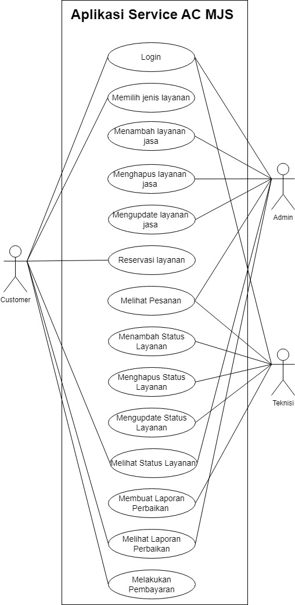
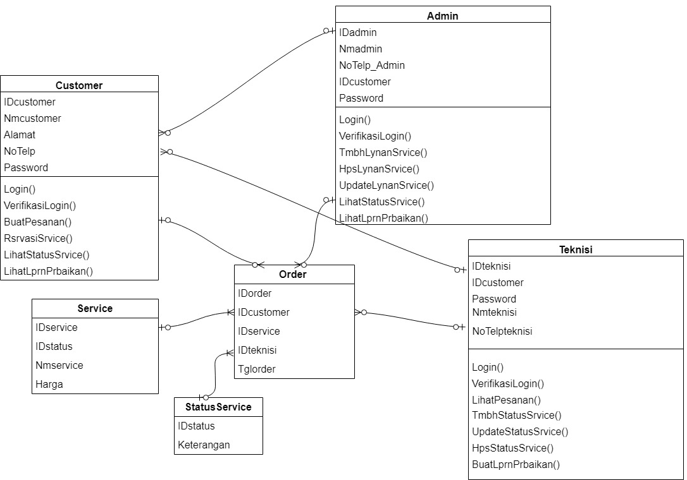

# MAJU JAYA SERVICE 
---

## Nama Anggota Kelompok 
- Ramadhani Prasetyo - 4522210009
- Daffa Abraar Sajuti - 4522210040
- Farah Tri Mahardini - 4522210042
- Salwa Khairu Mista - 4522210066
- Nadia Ayu Rahmawati - 4522210077
  
---
### Latar Belakang
Maju Jaya Service (MJS) adalah perusahaan layanan AC dan kulkas yang menyediakan berbagai layanan, termasuk perawatan rutin, penjualan, pemasangan, perbaikan, dan pemindahan. Mereka memiliki jadwal rutin untuk layanan harian dan melayani baik di Depok maupun di luar kota dalam skala kecil. Semua harga layanan dijelaskan secara rinci untuk transparansi konsumen, dan perusahaan memiliki logo yang dikenal oleh pelanggan. Meskipun mereka menyesuaikan pembayaran dengan keadaan, layanan kredit tidak tersedia saat ini. Tim yang terlatih siap untuk menangani pengerjaan, tetapi keberadaan tim kurang efektif jika pengerjaan dilakukan secara pribadi.Dengan masalah yang ada untuk memberikan kemudahan kepada konsumen dalam memperoleh informasi tentang layanan yang ditawarkan, termasuk jadwal rutin, harga-harga terkait, dan prosedur pemesanan. Upaya akan dilakukan untuk meningkatkan fitur dan keterjangkauan penggunaan bagi segmen tersebut. Melalui website, juga diharapkan dapat memfasilitasi pembayaran yang sesuai dengan kebutuhan pelanggan, termasuk kemungkinan pembayaran setelah pengerjaan untuk barang kecil dan penyesuaian pembayaran dari pihak ketiga. Dengan demikian, pembuatan website ini akan menjadi sarana penting dalam memperluas jangkauan dan meningkatkan efektivitas layanan MJS Maju Jaya Service.

---
### Kendala Maju Jaya Service 
1. Pemilik layanan sulit untuk memberikan informasi yang cukup kepada pelanggan secara efektif.
2. Skala layanan di luar kota yang sangat kecil, menjadi hambatan dalam pengembangan bisnis karena potensi pasar di luar kota kurang maksimal.
3. Kebanyakan pengguna pribadi pada website terdahulu
4. Jadwal layanan dan pemesanan yang bentrok membuat pemilik menjadi kurang efisien dalam manajemen jadwal.
5. Industri layanan sangat kompetitif, dengan banyak penyedia layanan yang bersaing untuk mendapatkan perhatian pelanggan.
6. Kurangnya perkembangan fitur website terdahulu

---
### Solusi  
**1. Fitur Customer**	
- login ke akun customer
- Reservasi Layanan
- Melihat Status Layanan
- Membuat Pesanan
- Melihat Laporan Perbaikan
  
**2. Fitur Admin**
- login ke akun Admin
- Menambah Layanan Jasa
- Menghapus Layanan Jasa
- Mengupdate Layanan Jasa
- Melihat Status Layanan
- Melihat Laporan perbaikan
  
**3.Fitur Teknisi**
- Login ke akun Teknisi
- Melihat Pesanan
- Menambah status Layanan
- Menghapus status Layanan
- Mengupdate status Layanan
- Melihat Status Layanan
- Membuat Laporan Perbaikan

---
### Actor
**Actor yang menggunakan**
1. Customer
2. Admin
3. Teknisi

---
### Use Case

---
### ERD (Entity Relationship Diagram)

---
### Class Diagram

---
### Flowchart

---
### Link Youtube
https://youtu.be/2l02bllTSH0?si=e_DfEx330IrAECAd

 
