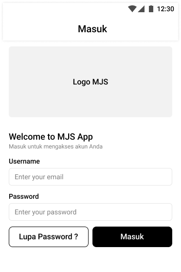
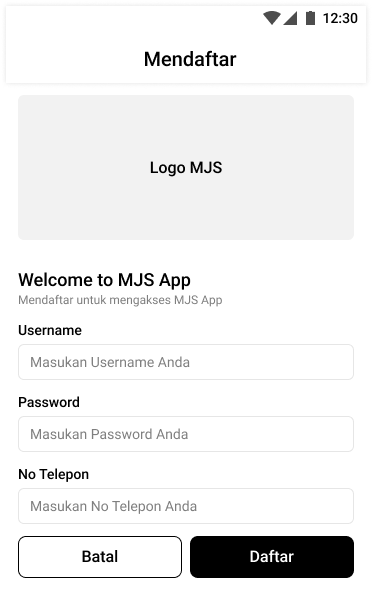
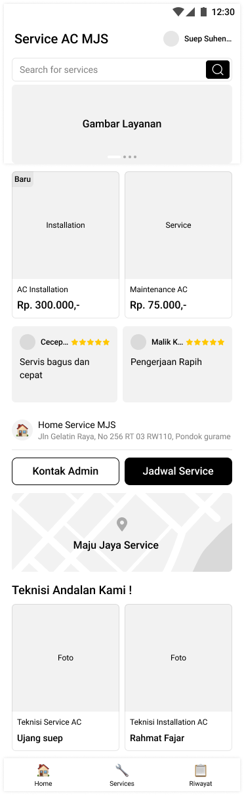
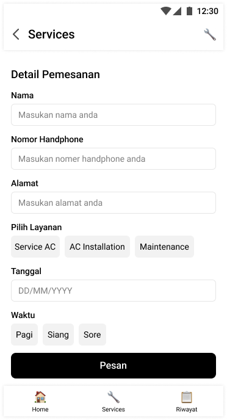
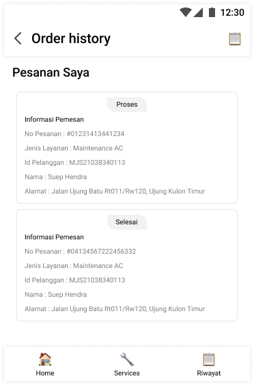
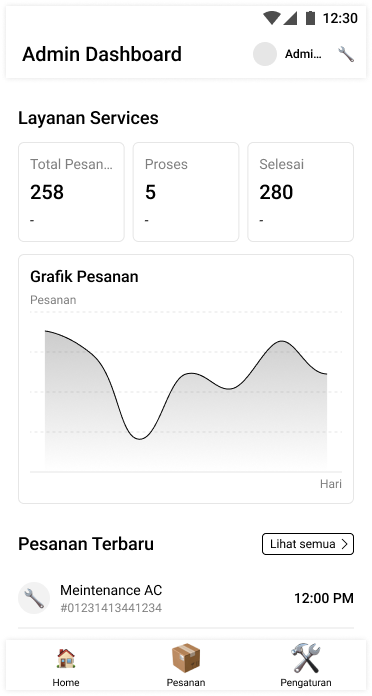
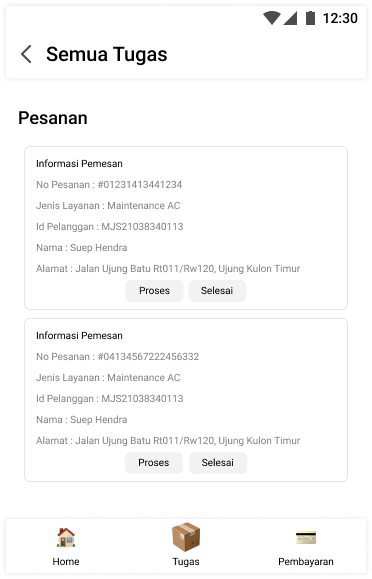
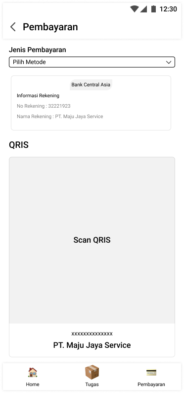

# MAJU JAYA SERVICE 
---

## Nama Anggota Kelompok 
- Ramadhani Prasetyo - 4522210009
- Daffa Abraar Sajuti - 4522210040
- Farah Tri Mahardini - 4522210042
- Salwa Khairu Mista - 4522210066
- Nadia Ayu Rahmawati - 4522210077
  
---
### Latar Belakang
Maju Jaya Service (MJS) adalah perusahaan layanan AC dan kulkas yang menyediakan berbagai layanan, termasuk perawatan rutin, penjualan, pemasangan, perbaikan, dan pemindahan. Mereka memiliki jadwal rutin untuk layanan harian dan melayani baik di Depok maupun di luar kota dalam skala kecil. Semua harga layanan dijelaskan secara rinci untuk transparansi konsumen, dan perusahaan memiliki logo yang dikenal oleh pelanggan. Meskipun mereka menyesuaikan pembayaran dengan keadaan, layanan kredit tidak tersedia saat ini. Tim yang terlatih siap untuk menangani pengerjaan, tetapi keberadaan tim kurang efektif jika pengerjaan dilakukan secara pribadi.Dengan masalah yang ada untuk memberikan kemudahan kepada konsumen dalam memperoleh informasi tentang layanan yang ditawarkan, termasuk jadwal rutin, harga-harga terkait, dan prosedur pemesanan. Upaya akan dilakukan untuk meningkatkan fitur dan keterjangkauan penggunaan bagi segmen tersebut. Melalui website, juga diharapkan dapat memfasilitasi pembayaran yang sesuai dengan kebutuhan pelanggan, termasuk kemungkinan pembayaran setelah pengerjaan untuk barang kecil dan penyesuaian pembayaran dari pihak ketiga. Dengan demikian, pembuatan website ini akan menjadi sarana penting dalam memperluas jangkauan dan meningkatkan efektivitas layanan MJS Maju Jaya Service.

---
### Kendala Maju Jaya Service 
1. Pemilik layanan sulit untuk memberikan informasi yang cukup kepada pelanggan secara efektif.
2. Skala layanan di luar kota yang sangat kecil, menjadi hambatan dalam pengembangan bisnis karena potensi pasar di luar kota kurang maksimal.
3. Kebanyakan pengguna pribadi pada website terdahulu
4. Jadwal layanan dan pemesanan yang bentrok membuat pemilik menjadi kurang efisien dalam manajemen jadwal.
5. Industri layanan sangat kompetitif, dengan banyak penyedia layanan yang bersaing untuk mendapatkan perhatian pelanggan.
6. Kurangnya perkembangan fitur website terdahulu

---
### Solusi  
**1. Fitur Customer**	
- login ke akun customer
- Reservasi Layanan
- Melihat Status Layanan
- Membuat Pesanan
- Melihat Laporan Perbaikan
  
**2. Fitur Admin**
- login ke akun Admin
- Menambah Layanan Jasa
- Menghapus Layanan Jasa
- Mengupdate Layanan Jasa
- Melihat Status Layanan
- Melihat Laporan perbaikan
  
**3.Fitur Teknisi**
- Login ke akun Teknisi
- Melihat Pesanan
- Menambah status Layanan
- Menghapus status Layanan
- Mengupdate status Layanan
- Melihat Status Layanan
- Membuat Laporan Perbaikan

---
### Actor
**Actor yang menggunakan**
1. Customer
2. Admin
3. Teknisi

---
### Use Case

Pada use case beberapa fungsi yang bisa digunakan tiap actor

1. Customer
- Customer dapat login ke akun customer 
- Customer dapat memilih jasa layanan 
- Customer dapat reservasi layanan
- Customer dapat melihat status layanan 
- Customer dapat melihat laporan perbaikan
- Lalu customer akan melakukan pembayaran
2. Admin 
- Admin dapat login ke akun admin 
- Admin dapat menambah layanan jasa  
- Admin dapat menghapus layanan jasa 
- Admin dapat mengupdate layanan jasa 
- Admin dapat melihat pesanan 
- Admin juga dapat melihat laporan perbaikan 
3. Teknisi 
- Teknisi dapat login ke akun teknisi 
- Teknisi juga dapat melihat pesanan 
- Teknisi dapat menambah status layanan
- Teknisi dapat menghapus status layanan
- Teknisi dapat mengupdate status layanan
- Teknisi akan membuat laporan perbaikan

---
### ERD (Entity Relationship Diagram)

Terdapat 6 entitas pada ERD Jasa Service MJS seperti:
- Customer
- Admin
- Teknisi
- Order
- Service
- StatusService

Tiap entitas memiliki atribut
- Customer --> (IDcustomer, Nmcustomer, NoTelp, Alamat, Password)
- Admin --> (IDadmin, Nmadmin, NoTelp_admin, Password, IDcustomer)
- Teknisis --> (IDteknisi, Nmteknisi, NoTelpteknisi, Password, IDcustomer)
- Order --> (IDorder, Tglorder, IDcustomer, IDstatus, IDteknisi, IDservice)
- Service --> (IDservice, Nmservice, Harga)
- StatusService --> (IDstatus, keterangan)

Adapun relationship antar entitas seperti:
1. dilayani --> pada entitas customer dan admin
2. ditangani --> pada entitas customer dan teknisi
3. Memesan --> pada entitas customer dan order
4. Mencakup --> pada entitas order dan Admin
5. Mencakup --> pada entitas order dan teknisi
6. Mencakup --> pada entitas order dan service
7. Berstatus --> pada entitas order dan StatusService

Terdapat kardinalitas juga seperti many to one

---
### Class Diagram

---
### Flowchart

Flowchart dimulai dengan customer melakukan login untuk masuk kedalam aplikasi begitu juga dengan admin dan teknisi.Selanjutnya customers memilih jenis layanan yang ada pada web MJS lalu customers mengisi detail pemesanan.Lalu admin yang sudah melakukan login ke aplikasi bisa langsung mengkonfirmasi pesanan, jika di tolak maka selesai.Jika diterima, maka teknisi yang sudah melakukan login ke aplikasi dapat menerima pesanan yang telah di konfirmasi admin, dan teknisi melakukan service pada rumah customer. Setelah teknisi melakukan service pada rumah customer, customers dapat melakukan pembayaran dan proses selesai. 

---
### DataMentah

---

### Wireframe Pelanggan Service
**Tampilan Login Pelanggan**

**Tampilan Daftar Pelanggan**

**Tampilan Home Page Pelanggan**

**Tampilan Pemesanan Pelanggan**

**Tampilan Riwayat Pemesanan Pelanggan**

### Wireframe Admin
**Tampilan Dashboard Admin**

**Tampilan Pesanan Admin**

**Tampilan Pengaturan**

**Tampilan Edit Layanan**

**Tampilan Tambah Staff**

### Wireframe Teknisi
**Tampilan Dashboard Teknisi**

**Tampilan Tugas Teknisi**

**Tampilan Pembayaran**

---
### Link Youtube
[Klik Untuk Melihat Vidio Presentasi Kelompok kami](https://youtu.be/2l02bllTSH0?si=e_DfEx330IrAECAd)

---
### Link Canva
[Klik Untuk Melihat PPT Kelompok kami](https://www.canva.com/design/DAF_T0ZNwiY/UormKtfOqmmJkgQ4OZPaoQ/edit)
